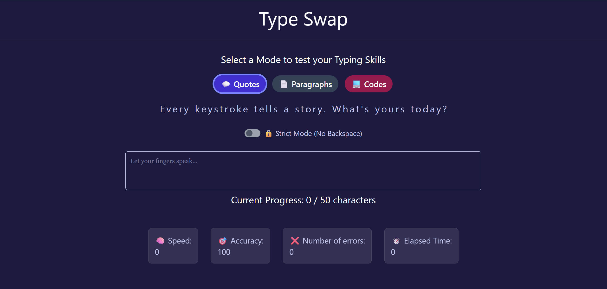

# TypeSwap

A challenge-driven typing interface built with React + TypeScript + Tailwind CSS. Strict Mode is active. Mistakes are final - 🚀 [Live Demo](https://sivakrishna6745.github.io/TypeSwap)

## 🧩 Features

-   Strict Mode toggle — one typo and mistake recorded
-   Dynamic text selector — swap between challenge sets
-   Ambient layout themes — mode-reactive visuals
-   Custom UI components — toggle switches, mode indicators

## 🛠️ Tech Stack

-   React 19 + TypeScript
-   Tailwind CSS + Framer Motion
-   Vite + GitHub Pages

## Pre-requisites:

-   [Node.js](https://nodejs.org) (latest stable version)
-   [Git](https://git-scm.com/downloads)
-   [VS code](https://code.visualstudio.com/download) or your favorite editor

## 📦 Setup

-   git clone https://github.com/SivaKrishna6745/TypeSwap.git
-   cd typeswap
-   npm install
-   npm run dev
-   Open your browser and visit:
    http://localhost:5173

## Homepage

